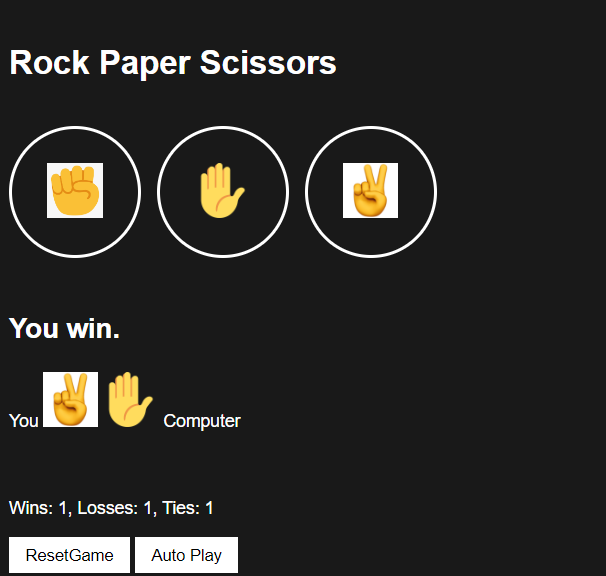

# Creating a Rock-Paper-Scissor game
## Html-Css and JavaScript
-Snap of what it LooksLike

# Rock-Paper-Scissors {Final Project}
- You pick a Move then The Computer will Randomly pick its Move.
- The game is Just easy, It just See's Who Won, Tied and Lost the Game. 
# setInterval || Timeout
- This will just make the game to play by itself {AutoPlay}

